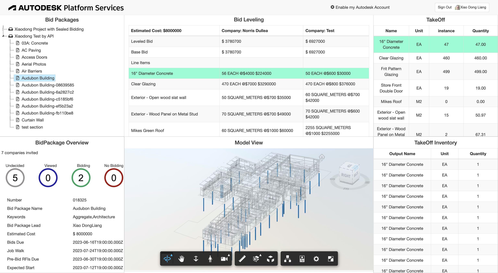

# Inspect quantities of bidleveling by takeoff

 
 

 
 

# Description

This sample demonstrates the use case: The members and bidders of Building Connected bid packages inspect the quantities of the scope-specific-form items, by the quantities from the corresponding models in Takeoff of Autodesk Construction Cloud. 

# Thumbnail
 

# Demonstration

# Setup

## Prerequisites

1. **APS Account**: Learn how to create a APS Account, activate subscription and create an app at [this tutorial](https://tutorials.autodesk.io/). For this new app, use **http://localhost:3000/aps/auth/callback** as Callback URL. Finally take note of the **Client ID**, **Client Secret** and Callback URL.
3. **ACC Account**: must be Account Admin to add the app integration. [Learn about provisioning](https://forge.autodesk.com/blog/bim-360-docs-provisioning-forge-apps). 
4. **ACC Takeoff**: must have one active ACC project with Takeoff module enabled. 
5. **Create Takeoff Items**:
    - 5.1. Upload some sheets/models to Takeoff >> Sheets & Models
    - 5.2. Create one package with the name which will be consistent to that in buildingconntected
    - 5.3. Create some takeoff types. The corresponding quantities will be generated automatically
6. **Building Connected Account and Subscription**: You must have a relevant BuildingConnected subscription for each endpoint. In this sample, BuildingConnected Pro is needed.
    - Users (no subscription required)
    - Opportunities (Bid Board Pro)
    - All others (BuildingConnected Pro)
7. **Create Bid Leveling Data**:
     - 7.1. Create one test project.
     - 7.2. Associate this project with the ACC project in step 4.
    -  7.3. Create one bid package with the same name in step 5.2. In the specific scope form, create some items with the same name and types of takeoff items in step 5.3.
     - 7.4. Publish this bid package and invite some bidders.
     - 7.5. Bidders send bid with filling in the unit price and quantity of the items of specific scope form.
     - 7.6. Check the bid leveling table.
8. **Node.js**: knowledge with [**Node.js**](https://nodejs.org/en/).
9. knowledge with **html5**,**JavaScript**, **css**,**jQuery** and **bootstrap**
10.knowledge with **Data Management API with ACC Docs**, **Viewer SDK** and **ACC Takeoff API** and **BuildingConnected API** etc.
 
## Running locally

Install [NodeJS](https://nodejs.org), version 8 or newer.

Clone this project or download it (this `nodejs` branch only). It's recommended to install [GitHub desktop](https://desktop.github.com/). To clone it via command line, use the following (**Terminal** on MacOSX/Linux, **Git Shell** on Windows):

    git clone https://github.com/autodesk-platform-services/aps-bidleveling-inspection-by-takeoff

Install the required packages using `npm install`. Set the environment variables with your client ID, client secret, callback url and finally start it. Via command line, navigate to the folder where this repository was cloned and use the following:

Mac OSX/Linux (Terminal)

    npm install
    export APS_CLIENT_ID=<<YOUR CLIENT ID FROM DEVELOPER PORTAL>>
    export APS_CLIENT_SECRET=<<YOUR CLIENT SECRET>>
    export APS_CALLBACK_URL=<<YOUR CALLBACK URL>>
    npm start

Windows (use **Node.js command line** from Start menu)

    npm install
    set APS_CLIENT_ID=<<YOUR CLIENT ID FROM DEVELOPER PORTAL>>
    set APS_CLIENT_SECRET=<<YOUR CLIENT SECRET>>
    set APS_CALLBACK_URL=<<YOUR CALLBACK URL>>
    npm start

OR, set environment variables at [launch.json](/.vscode/launch.json) for debugging.
 
 ## Use Cases

1. Open the browser: [http://localhost:3000](http://localhost:3000). Please watch the [Video](https://youtu.be/W9rGN-2XnRM) for the detail and usage.

2. After the user logging succeeds, the code will start to extract all projects of BuildingConnected that this user created, all packages with the project. 

3. Click one BuildingConnected package which is created in step 7.4. The corresponding bid leveling will be loaded, including the items of scope-specific-form.  In the same time, the corresponding takeoff items in the associated ACC project will also be loaded. Each takeoff type is listed, including quantity, unit etc.

4. Click one takeoff item, the model/sheet will be loaded in viewer. The corresponding bid item in bid leveling table is also highlighted.

5. In turn, if click one bid item in bid leveling table, the corresponding takeoff item is also highlighted. 

By the way above, the user can check if the quanities in bidding matches to the models quantities. 
  

## Deployment

To deploy this application to Heroku, the **Callback URL** for Forge must use your `.herokuapp.com` address. After clicking on the button below, at the Heroku Create New App page, set your Client ID, Secret and Callback URL for Forge.

## Known Tips
1. Sheets & Models for ACC TakeOff is not ACC>>Files, while BuildingConnected project associates with ACC>>Files now. So this sample has to map BuildingConnected files to ACC>>Takeoff>>Sheets & Models
2. The mapping of bid package and takeoff package is by their name. ensure to make them consistent in order to work with this sample

## Limitations
1. This sample does not implement complex scope-specific-form such as nested sections.
2. This sample does not implement all unit types.

# Further Reading

- [Data Management](https://aps.autodesk.com/en/docs/data/v2/developers_guide/overview/)
- [Model Derivative](https://aps.autodesk.com/en/docs/model-derivative/v2/developers_guide/overview/)
- [Viewer](https://aps.autodesk.com/en/docs/viewer/v7/developers_guide/overview/)
- [TakeOff](https://aps.autodesk.com/en/docs/acc/v1/tutorials/takeoff/)
- [BuildingConnected](https://aps.autodesk.com/en/docs/buildingconnected/v2/developers_guide/overview/)

### Blogs
- [APS Blog](https://aps.autodesk.com/blog)
- [Field of View](https://fieldofviewblog.wordpress.com/), a BIM focused blog

## License
This sample is licensed under the terms of the [MIT License](http://opensource.org/licenses/MIT). Please see the [LICENSE](LICENSE) file for full details.

## Written by
Xiaodong Liang [@coldwood](https://twitter.com/coldwood), [Developer Advocacy and Support](http://aps.autodesk.com)
